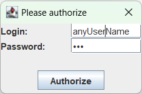

# JavaSwingPhoneBook

A simplest java swing phone book project with restricted functionality 

App starts with auth frame: 

You have choice to continue with authorization or close the app: 

New record is added to the end of table with scrolling to the end: 

Record deletion:

* You have to select a row for deletion: 
  
* You are able to delete multiple rows selections: 
  
  * With removal message confirmation: 
  
  * As the result You have: 
  

